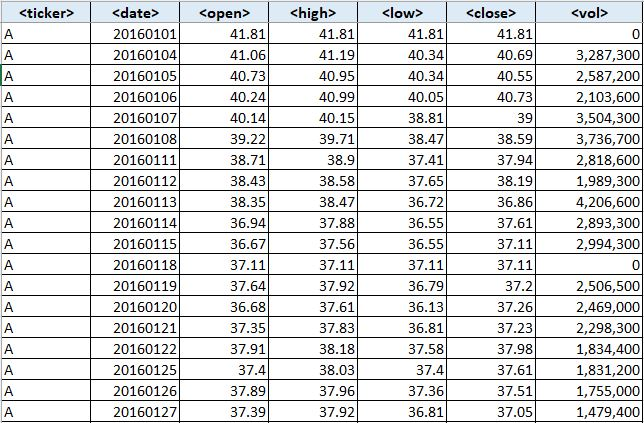
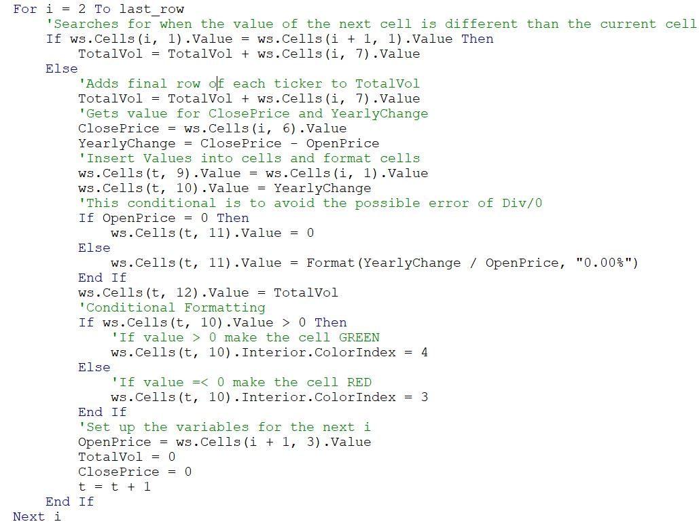
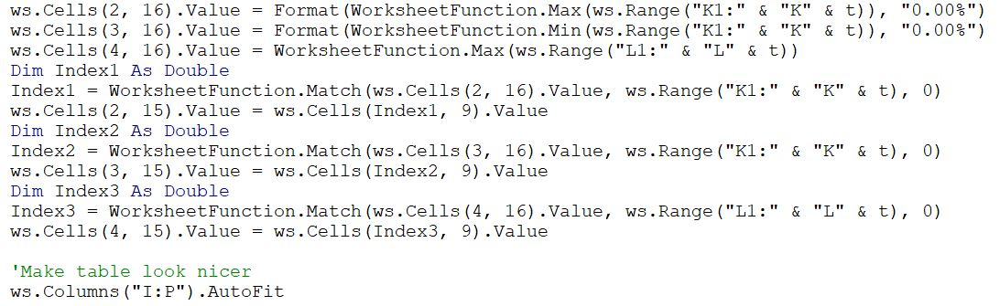
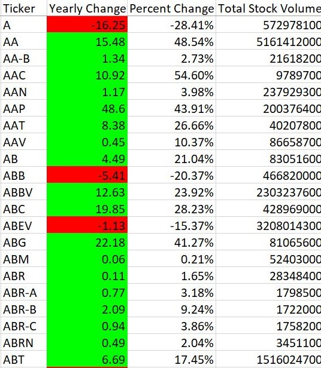

# StockData_VBA

## Introduction
* Use VBA Macros to automate processes in excel. 
* The joy of VBA is to take the tediousness out of repetitive tasks and run them over and over again with a click of the button. That is exactly what the VBA code in this repo does. 
* With a single click of a button the macro creates 2 annual summary tables based on the stock data for each tab in the spreadsheet.
* To run the VBA macro code for this repo all you have to do is navigate into the "01 Before Running Macros" folder. Then open up the "Multiple_Stock_Year_Data" spreadsheet. Then go to the VBA Button tab and click the button. This will automatically run the macro
   * Do not worry if the macro takes a few minutes to load
   * Make sure that the "Multiple_Year_Stock_Data" spreadsheet is saved as a .xlsm also known as type "Microsoft Excel Macro-Enabled Worksheet" if the spreadsheet is not saved in this format it will not be able to run the macro 

* Macro output

   * Table 1 has the yearly change, yearly percentage change, and the total stock volume traded for every single stock from the starting data. 
   * Table 2 has the stock with the greatest % increase that year, the stock with the greatest % decrease that year, and the stock with the greatest total volume traded.

## System Requirements 
### Software
The only software that is required for this repo is Microsoft Excel. 

### Libraries / Add -ins
The only add - in that is required for this repo is Macros in the Developr tab in Excel

## Data Engineering 
### Starting Data
* I started this repo with 2 excel spreadsheets, "Alphabetical_Testing" and "Multiple_Year_Stock_Data", both of which can be found in the folder "01 Before Running Macros".
   *  "Alphabetical_Testing.xlsm" is just a sample of "Mulitple_Year_Stock_Data.xlsm", it only contains data for 2016 whereas "Multiple_Year_Stock_Data.xlsm" contains data for 2014- 2016. 
   *  This sample data is helpful because it allows macros to run test code much faster than the macro would take to execute the same test code on the full dataset 
     *  In other words the aphabetical testing spreadsheet is only used to save time testing code 

### VBA Code 
* Some of the functions included in the VBA code below are for loops, if conditionals, formatting, match, and many others. 

#### Table 1 Code

#### Table 2 Code

## Results Tables 

#### Table 1 Sample

#### Table 2 Sample

