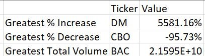

# StockData_VBA
* In this repo I used VBA code (Excel Macros) to automate processes in excel. 
* The joy of VBA is to take the tediousness out of repetitive tasks and run them over and over again with a click of the button. That is exactly what the VBA code in this repo does. 
* With a single click of a button the macro creates 2 annual summary tables based on the stock data for each tab in the spreadsheet.
* Table 1 has the yearly change, yearly percentage change, and the total stock volume traded for every single stock from the starting data. 
* Table 2 has the stock with the greatest % increase that year, the stock with the greatest % decrease that year, and the stock with the greatest total volume traded.

* To run the macro code for this repo all you have to do is open any of the spreadsheets in this repo then go to the VBA Button tab then click on the button. The results of the macro will be more evident if you run the macro in one of the files in the "01 Before Running Macros" folder. 

## Starting Data 
* I started this repo with 2 excel spreadsheets, "Alphabetical_Testing" and "Multiple_Year_Stock_Data", both of which can be found in the folder "01 Before Running Macros". "Alphabetical_Testing.xlsm" is a sample of "Mulitple_Year_Stock_Data.xlsm", it only contains data for 2016 whereas "Multiple_Year_Stock_Data.xlsm" contains data for 2014- 2016. I chose to make this sample of the dataset because macros can be slow when working with a lot of data. So to save time I used the sample dataset, Alphabetical_Testing, to test my macro code and make sure that it worked sucessfully before running the macro on the entire dataset, Multiple_Year_Stock_Data.

*  Both spreadsheets contain the same columns ticker, date, open, high, low, close, and vol. The data in each column is fairly self-explanatory based on the column headers.

## VBA Code 
* In order to create the 2 summary stock tables that I described above I wrote VBA code. I used features in macros such as for loops, if conditionals, formatting, match, and many others. 
* Below of screenshots of the code I used to create each table as well as the tables themselves. 

#### Table 1 Code

#### Table 2 Code

## Results Tables 

#### Table 1 Sample

#### Table 2 Sample

